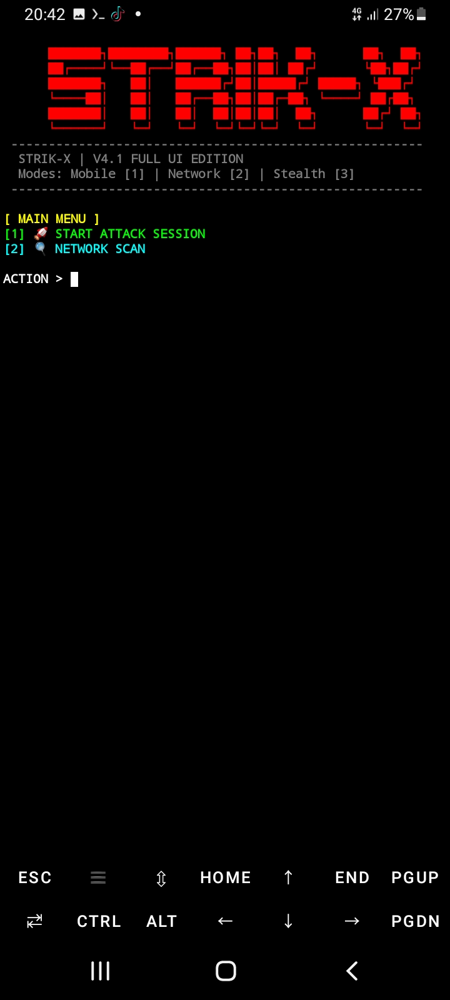

# 🚀 MobFlood-STRIK-X V4.1 🌊
**Advanced Mobile Packet Flooder & Network Stress Testing Tool**
**เครื่องมือทดสอบประสิทธิภาพเครือข่ายระดับ "สวนน้ำ" มหาประลัย**

---

## 🇺🇸 English Version

### 📖 Usage Guide
Open your "Water Park" and run the following command in your terminal:
`python STRIK-X.py`

### 🛠️ Parameters
* **Target IP/URL:** The destination you want to flood/test.
* **Port:** Connection port (e.g., 80 for HTTP, 443 for HTTPS).
* **Packets/Threads:** Amount of "water" (data packets) to send concurrently.

### 📥 Quick Installation (One-Click)
Copy and paste this command into your Termux:
`pkg update -y && pkg upgrade -y && pkg install python git -y && git clone https://github.com/Aether0777/MobFlood-in-Termux && cd MobFlood-in-Termux && python STRIK-X.py`

### ⚠️ Disclaimer
This tool is for educational and authorized security testing purposes only. The developer is not responsible for any misuse, legal consequences, or damage caused by this program.

---

## 🇹🇭 เวอร์ชันภาษาไทย 🌊

### 📖 คู่มือการใช้งาน
เปิดสวนน้ำของคุณแล้วใช้คำสั่งด้านล่างนี้ใน Termux เพื่อเริ่มการทำงาน:
`python STRIK-X.py`

### 🛠️ รายละเอียดพารามิเตอร์
* **Target IP/URL:** ไอพีหรือโดเมนเป้าหมายที่ต้องการปล่อยน้ำ (Packet)
* **Port:** พอร์ตที่ต้องการเชื่อมต่อ (เช่น 80 สำหรับ HTTP, 443 สำหรับ HTTPS)
* **Packets/Threads:** จำนวนมวลน้ำที่ส่งออกไปพร้อมกันเพื่อทดสอบขีดจำกัดของระบบ

### 📥 ติดตั้งรวดเร็ว (คลิกเดียวจบ)
ก๊อปปี้สคริปต์บรรทัดเดียวนี้ไปวางเพื่อเปิดเครื่องเล่น:
`pkg update -y && pkg upgrade -y && pkg install python git -y && git clone https://github.com/Aether0777/MobFlood-in-Termux && cd MobFlood-in-Termux && python STRIK-X.py`

### ⚠️ ข้อควรระวัง
เครื่องมือนี้เปรียบเสมือนสวนน้ำจำลองเพื่อการศึกษาและการทดสอบระบบในขอบเขตที่ได้รับอนุญาตเท่านั้น ผู้พัฒนาจะไม่รับผิดชอบต่อการนำไปใช้งานในทางที่ผิดกฎหมาย หรือสร้างความเสียหายใดๆ ต่อผู้อื่น

